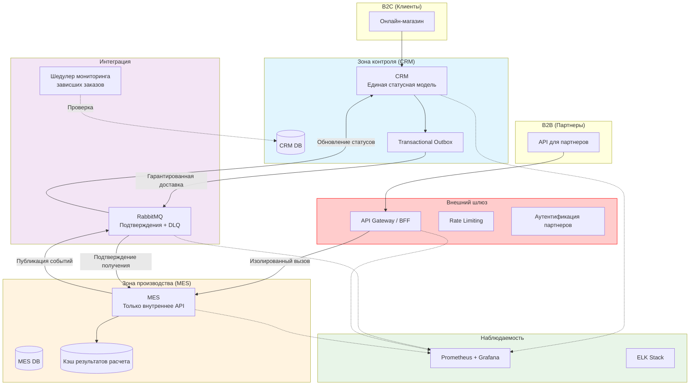

# Задание 1. Анализ, идентификация проблем и решений, планирование

Ключевая информация о компании "Александрит".
Компания «Александрит» — производитель ювелирных украшений с возможностью заказа по индивидуальным 3D-моделям. Бизнес растет, но столкнулся с критическими проблемами:
- Клиенты (B2C) жалуются на просроченные заказы (обещали 3 недели, проходят месяцы)
- Партнеры (B2B через API) тоже не получают заказы вовремя и разрывают контракты
- Операторы MES жалуются на медленную работу системы
- Производственные мощности позволяют кратный рост, но заказы "теряются"

## 1. Анализ и идентификация проблемных мест

### Категория: Бизнес-процессы и целостность данных

| ID | Проблема | Описание                                                                                                                                                                                                           |
|----|----------|--------------------------------------------------------------------------------------------------------------------------------------------------------------------------------------------------------------------|
| **P1** | **Разорванная статусная модель заказа** | Жизненный цикл заказа разделен между CRM и MES. Нет единого источника правды (Single Source of Truth), что особенно нужно для критически важных статусов: `PRICE_CALCULATED`, `MANUFACTURING_STARTED`, `SHIPPED`. |
| **P2** | **Ненадежная интеграция CRM-MES** | RabbitMQ используется только как "транспорт" без гарантий обработки. Отсутствуют подтверждения (Acknowledgement), повторные попытки (Retries) и механизм dead-letter queue.                                        |
| **P3** | **Рост "потерянных" заказов после открытия API** | Внешние партнеры создают заказы через API, что многократно увеличило поток. Существующая хрупкая интеграция не справляется с объемом.                                                                              |

### Категория: Производительность и масштабируемость

| ID | Проблема | Описание                                                                                                                                                                      |
|----|----------|-------------------------------------------------------------------------------------------------------------------------------------------------------------------------------|
| **P4** | **Деградация производительности MES** | Медленная загрузка дашборда оператора. Фильтрация и пагинация не помогли → вероятны тяжелые SQL-запросы, отсутствие индексов, рост данных.                                    |
| **P5** | **Отсутствие кэширования** | MES самостоятельно и долго считает стоимость на основе 3D-модели. Результат не кэшируется → при сбое или повторном запросе пересчет заново (от 2 до 30 минут).                |
| **P6** | **Монолитная база данных** | Каждая БД работает в режиме "одна нода на запись и чтение". Это узкое место для роста. При дальнейшем увеличении нагрузки БД MES или CRM станут главным бутылочным горлышком. |

### Категория: Надежность и Наблюдаемость

| ID | Проблема                           | Описание                                                                                                                                                    |
|----|------------------------------------|-------------------------------------------------------------------------------------------------------------------------------------------------------------|
| **P7** | **Отсутствие наблюдаемости**       | Нет метрик, централизованных логов, трейсинга. Команда узнает о проблемах только из жалоб.                                                                  |
| **P8** | **Хрупкий CI/CD и процесс релиза** | Ручное тестирование E2E — медленный и ненадежный процесс. Задержки релизов "до месяца" → исправления критических багов доходят до продакшена слишком долго. |

### Категория: Архитектура и Безопасность

| ID     | Проблема                           | Описание                                                                                                                                                                                                                                              |
|--------|------------------------------------|-------------------------------------------------------------------------------------------------------------------------------------------------------------------------------------------------------------------------------------------------------|
| **P9** | **MES выполняет роль внутреннего и внешнего API одновременно**       | MES предоставляет единое API как для внутренней интеграции с CRM, так и для внешних партнеров. Контура не разделы, в результате нагрузка от внешних потребителей влияет на внутреннюю производительность. Нет возможности гарантировать SLA отдельно. |

---

## 2. Инициативы по устранению проблем

| ID     | Инициатива | Описание                                                                                                                                                                                                    | Связь с проблемами |
|--------|------------|-------------------------------------------------------------------------------------------------------------------------------------------------------------------------------------------------------------|--------------------|
| **I1** | **Рефакторинг интеграции CRM-MES** | Реализация паттерна Transactional Outbox в CRM. Переход на надежный механизм приема сообщений в MES с подтверждением обработки и dead-letter queue. Добавление шедулера для мониторинга "зависших" заказов. | P2, P3             |
| **I2** | **Введение единой статусной модели** | Определение общих бизнес-статусов заказа для коммуникации с клиентами. CRM становится оркестратором, агрегирующим статусы от MES.                                                                           | P1, P3             |
| **I3** | **Оптимизация производительности MES** | Анализ и оптимизация SQL-запросов для дашборда оператора (индексы, денормализация). Внедрение локального кэширования результатов расчета стоимости.                                                         | P4, P5             |
| **I4** | **Внедрение базового мониторинга и логирования** | Настройка сбора метрик (Prometheus + Grafana) и централизованного сбора логов (ELK).                                                                                                                        | P7                 |
| **I5** | **Внедрение распределенной трассировки** | Трейсинг на основе OpenTelemetry для отслеживания полного пути прохождения запроса.                                                                                                                         | P7                 |
| **I6** | **Автоматизация тестирования** | Покрытие критических сценариев автотестами (API, интеграционные) для сокращения времени регрессионного тестирования.                                                                                        | P8                 |
| **I7** | **Аудит и оптимизация БД** | Аудит схем БД, добавление индексов, рассмотрение шардирования и партиционирования таблиц заказов.                                                                                                           | P4, P6             |
| **I8** | **Выделение отдельного API Gateway для внешних партнеров** | Создать отдельный API-шлюз для внешних партнеров. MES оставить для внутренних нужд CRM. API Gateway будет выполнять роль "фасада" — принимать внешние запросы, трансформировать их, применять rate limiting, аутентификацию и передавать в MES через изолированный контур.                                                                                                           | P3, P9             |

---

## 3. Приоритеты и целевая архитектура

### 3.1. Целевая архитектура через полгода

Через полгода система должна перестать "терять" заказы и дать команде инструменты для контроля над ситуацией.

#### Ключевые характеристики целевой архитектуры:
* Надежность: CRM гарантированно доставляет события в MES через Transactional Outbox. MES явно подтверждает обработку. CRM отслеживает "зависшие" заказы.
* Единая статусная модель: CRM хранит и предоставляет клиентам (B2C и B2B) согласованные бизнес-статусы, агрегируя данные от MES.
* Производительность: Дашборд оператора MES загружается быстро (< 2-3 сек). Расчеты стоимости кэшируются.
* Наблюдаемость: У команды есть дашборды с ключевыми метриками (новые заказы, время расчета, глубина очереди).
* Процессы: Критический путь заказа покрыт автотестами. Время выкатки релизов сократилось.

### 3.2 Три приоритетные инициативы на ближайшие полгода
Приоритетные инициативы должны обеспечивать следующие качества:
устраняют потерю денег и клиентов;
создают основу для будущих улучшений.

1. Приоритет 1: I1 + I2 (Надежность интеграции + Единая статусная модель)
Самый важный приоритет. Пока заказы теряются в интеграции, бизнес будет нести убытки и терять репутацию. Решение проблемы "потерянных" заказов — задача №1.
Инициативы объединены в одну, т.к. неразрывно связаны. Недостаточно просто гарантировать доставку — нужно, чтобы системы говорили на одном языке и CRM могла контролировать весь цикл.
Ожидаемый эффект:
* Исчезновение "черных дыр", в которых пропадают заказы
* Возможность дать клиенту точный ответ о статусе
* Восстановление доверия B2B-партнеров
* Прозрачность жизненного цикла для менеджеров

2. Приоритет 2: I8 (Выделение API Gateway для внешних партнеров)/
Ожидаемый эффект:
* Останавливается отток партнеров из-за нестабильности API
* Изолируется внешняя нагрузка (меньше страдают операторы MES)
* Обеспечивается безопасность (внешние вызовы не имеют прямой доступ к внутренним операциям MES)

4. Приоритет 3: I3 + I4 (Оптимизация производительности MES + Мониторинг)
Важный блок, так как влияет на внутренних пользователей (операторов), от которых напрямую зависит выполнение заказов.
А при отсутствии мониторинга сложно принимать обоснованные решения.
Ожидаемый эффект от оптимизации производительности:
* Ускорение работы операторов
* Снижение демотивации персонала
* Увеличение пропускной способности производства без дополнительных ресурсов
* Устранение жалоб операторов на медленную систему
Ожидаемый эффект от мониторинга:
* Возможность проактивно обнаруживать проблемы до жалоб клиентов
* Понимание реальной нагрузки на компоненты системы
* Данные для дальнейшей оптимизации (подтверждение эффективности I1-I3)
* Ускорение расследования инцидентов

Комментарии по инициативам, не вошедшим в "топ-3":
* I5 (Трейсинг) - Следующий шаг после внедрения базового мониторинга, когда потребуется более глубокий анализ распределенных сценариев.
* I6 (Автотесты) - Критически важна в долгосрочной перспективе, но не решит проблему "горящих" заказов здесь и сейчас. Можно начать с малого параллельно.
* I7 (Аудит и оптимизация БД) - Будет естественным продолжением I3 и I4, когда мы увидим реальные проблемы с производительностью на графиках.

